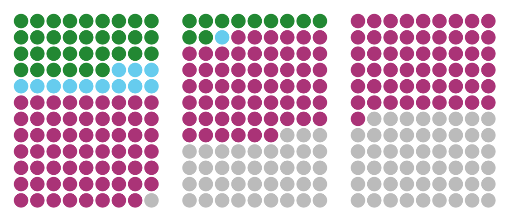

# WafflePlots

Making waffle plots in Igor Pro. Explainer [here](https://quantixed.org/2021/12/06/line-up-waffle-plots-for-colocalisation-data/).

Intended for visualisation of microscopy colocalization data. Instead of using Venn or Euler diagrams, waffle plots allow us to get a feel of object-based colocalisation (sometimes referred to as co-occupation).


## Example

```
WaffleMaker(33,12,62,9,0)
WaffleMaker(11,1,57,9,1)
WaffleMaker(0,0,55,8,2)
EqualiseWaffles() // makes all waffles the same size
PXPUtils#MakeTheLayouts("wafflePlot",0,6, alphaSort = 1, saveIt = 0)
```

## Alternative colour schemes

Aome alternative colour presets are available from the _Macros_ menu.

### Green-Cyan-Magenta (GCM)


### Tol 1


### Tol 2



### Wong 1


### Wong 2


## Other symbols

Users can set whatever colour they prefer by selecting _Macros > Waffle Colors > User Selection_

Symbols can be customised by clicking on the presets in _Macros > Waffle Symbols_ or by selecting _Specify..._ in that sub-menu.
Input is the symbol integer for graphs in Igor.

This is an example in the base colour set using "filled squares".


## Requirements

- `PXPUtils.ipf` - available [here](https://github.com/quantixed/PXPUtils) - to display waffles easily
- Tested on Igor Pro 8 and 9, macOS
